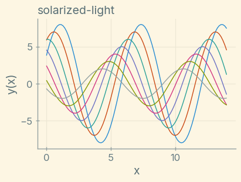
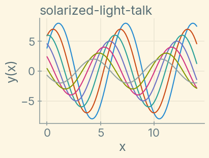

# simplstyles

Simple and clean matplotlib style sheets.

## Installation and use

Import simplystyles as you would any other package

```py
>>> import simplstyles
```

and use stylesheets as you would any other matplotlib style, with the same import structure as regular package modules:

```py
>>> import matplotlib.pyplot as plt
>>> plt.style.use("simplstyles.clean")
```

> [!NOTE]
> All stylesheets use a font stack which prefers Inter, then Helvetica, then falls back on system defaults. Inter is freely available [from its creator](https://rsms.me/inter/).

## Examples

### Clean

<p float="left">
  
   
  
  
</p>

### ayu

<p float="left">
  
   
  
  
</p>

### Nord

<p float="left">
  
   
  
  
</p>

### Solarized

<p float="left">
  
   
  
  
</p>
