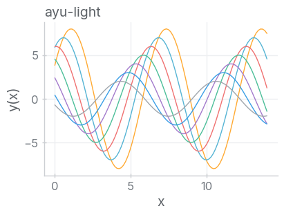
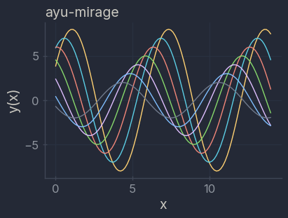
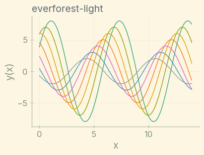
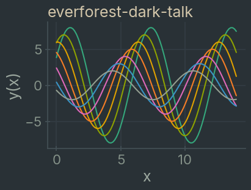
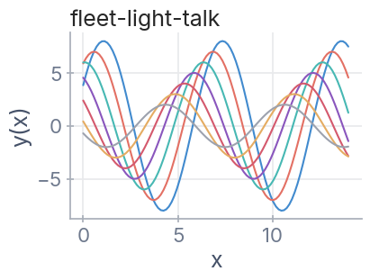

# simplstyles

[](https://github.com/garland-culbreth/simplstyles)
[](https://pypi.org/project/simplstyles/)
[](https://github.com/astral-sh/uv)

Simple and clean matplotlib style sheets.

## Installation

The latest release can be installed from PyPI:

```txt
pip install simplstyles
```

## Use

Import simplstyles as you would any other package

```py
>>> import simplstyles
```

and use stylesheets as you would any other matplotlib style, with the same import structure as regular package modules:

```py
>>> import matplotlib.pyplot as plt
>>> plt.style.use("simplstyles.clean.light")
```

All stylesheets use a font stack which prefers Inter, then Helvetica, then falls back on system defaults. Inter is freely available [from its creator](https://rsms.me/inter/).

## Examples

### Clean

<p float="left">
  
   
  
  
</p>

### [ayu](https://github.com/ayu-theme/ayu-colors)

<p float="left">
  
   
  
  
</p>

### [Nord](https://github.com/nordtheme/nord)

<p float="left">
  
   
  
  
</p>

### [Everforest](https://github.com/sainnhe/everforest)

<p float="left">
  
   
  
  
</p>

### [Solarized](https://github.com/altercation/solarized)

<p float="left">
  
   
  
  
</p>

### fleet

<p float="left">
  
   
  
  
</p>

## Accessibility

Color cycles are selected to be as colorblind safe as possible from the basis theme's available colors. However, some limitations are inevitable as many of the basis themes were not originally developed for data visualization. Please be mindful when preparing figures to ensure they are legible to all viewers.
